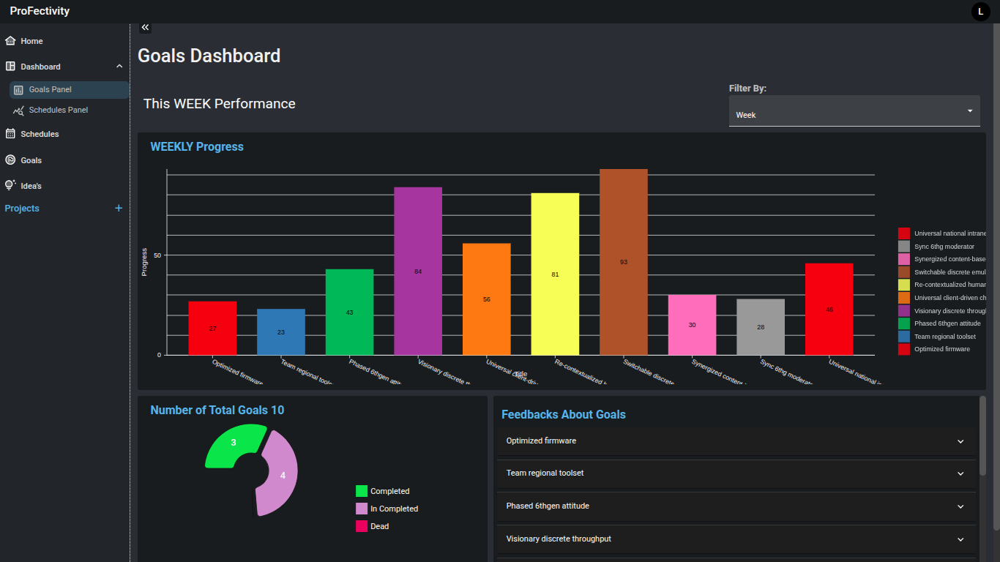

<div align="center">

# ⏳ Profectivity
A simple yet powerful productivity app to help users manage tasks, set goals & deadlines, set schedule, store ideas, and stay organized. It also movtivate user with progress graphs. Built with React for the frontend and Laravel for the backend.


</div>

## Preview



## 🚀 Features

- ✅ Add, edit, and delete goals
- ✅ Add, edit, and delete schedule
- 📜 Add, edit, and delete Project
- 📅 Set deadlines
- 🌙 Dark mode support
- 🎨 Various themes
- 📊 Track task progress graphically
- ⚠  Notify user about info 
- 🔒 User authentication (Login / Signup)

## 📂 Project Structure

```
├── .dockerignore
├── .editorconfig
├── .env.example
├── .gitattributes
├── .rnd
├── Procfile
├── README.md
├── app/
│   ├── Console/
│   │   ├── Commands/
│   │   │   └── NotifyIncompleteGoals.php
│   │   └── Kernel.php
│   ├── Exceptions/
│   │   └── Handler.php
│   ├── Http/
│   │   ├── Controllers/
│   │   │   ├── Controller.php
│   │   │   └── api/
│   │   │       ├── AuthController.php
│   │   │       ├── GoalController.php
│   │   │       ├── GoalFeedbackController.php
│   │   │       ├── IdeaController.php
│   │   │       ├── MenuItemController.php
│   │   │       ├── NotificationsController.php
│   │   │       ├── ProjectController.php
│   │   │       ├── ScheduleController.php
│   │   │       ├── ScheduleTemplateController.php
│   │   │       └── TaskController.php
│   │   └── Kernel.php
│   ├── Listeners/
│   │   └── CreateDefaultMenuItems.php
│   ├── Models/
│   │   ├── Goal.php
│   │   ├── GoalFeedback.php
│   │   ├── Idea.php
│   │   ├── MenuItem.php
│   │   ├── Project.php
│   │   ├── ScheduleTemplate.php
│   │   ├── Task.php
│   │   ├── User.php
│   │   └── schedule.php
│   ├── Notifications/
│       └── GoalNotification.php
├── client/
│   ├── .eslintrc.cjs
│   ├── README.md
│   ├── backup.js
│   ├── index.html
│   ├── package-lock.json
│   ├── package.json
│   ├── public/
│   │   ├── Assets/
│   │   │   ├── dd.png
│   │   │   └── user.jpg
│   │   └── vite.svg
│   ├── src/
│   │   ├── App.jsx
│   │   ├── components/
│   │   │   ├── BarChart.jsx
│   │   │   ├── Calendar.jsx
│   │   │   ├── ColorChip.jsx
│   │   │   ├── CustomAlert.jsx
│   │   │   ├── CustomCard.jsx
│   │   │   ├── CustomMenu.jsx
│   │   │   ├── CustomTemplate.jsx
│   │   │   ├── Header.jsx
│   │   │   ├── HomeBox.jsx
│   │   │   ├── LineBarChart.jsx
│   │   │   ├── MenuListComp.jsx
│   │   │   ├── ModeToggle.jsx
│   │   │   ├── PieChart.jsx
│   │   │   ├── Project_Cat_comp.jsx
│   │   │   ├── SidebarItem.jsx
│   │   │   └── UpperHeader.jsx
│   │   ├── config/
│   │   │   ├── DashBoard.js
│   │   │   └── Goal.js
│   │   ├── index.css
│   │   ├── main.jsx
│   │   ├── redux/
│   │   │   ├── store.js
│   │   │   └── userReducers.js
│   │   ├── scenes/
│   │   │   ├── dashboard/
│   │   │   │   ├── GoalsPanel.jsx
│   │   │   │   └── SchedulesPanel.jsx
│   │   │   ├── feedback/
│   │   │   │   └── form.jsx
│   │   │   ├── global/
│   │   │   │   ├── Sidebar.jsx
│   │   │   │   ├── Topbar.jsx
│   │   │   │   └── index.jsx
│   │   │   ├── goals/
│   │   │   │   ├── create.jsx
│   │   │   │   └── index.jsx
│   │   │   ├── home/
│   │   │   │   └── index.jsx
│   │   │   ├── ideas/
│   │   │   │   ├── create.jsx
│   │   │   │   └── index.jsx
│   │   │   ├── notifications/
│   │   │   │   └── index.jsx
│   │   │   ├── project/
│   │   │   │   └── index.jsx
│   │   │   ├── schedule/
│   │   │   │   └── index.jsx
│   │   │   ├── signIn/
│   │   │   │   └── index.jsx
│   │   │   ├── signUp/
│   │   │   │   └── index.jsx
│   │   │   └── templates/
│   │   │       ├── form.jsx
│   │   │       └── index.jsx
│   │   ├── styles/
│   │   │   └── calendar.css
│   │   ├── theme.js
│   │   └── utils/
│   │       └── Last_Opened.js
│   └── vite.config.js
├── composer.json
├── composer.lock
├── dockerfile
├── package-lock.json
├── package.json
├── phpunit.xml
├── public/
│   ├── .htaccess
│   ├── favicon.ico
│   ├── index.php
│   └── robots.txt
├── routes/
│   ├── api.php
│   ├── channels.php
│   ├── console.php
│   └── web.php
└── vite.config.js

```
## 🛠️ Tech Stack

- Frontend: React, CSS, Mui
- Backend: Laravel, MySQL
- Authentication: Session-based authentication (secure cookies)
## Installation

1. Clone the repository
```bash
git clone https://github.com/aamirmalik75/productivity-app.git
```

2. Frontend setup
```bash
cd client
npm install
```

3. Laravel backend setup in /productivity-app
```bash
composer install
php artisan migrate
npm run start
```

## 📄 License

This project is licensed under the MIT License - see the [LICENSE](LICENSE) file for details.
